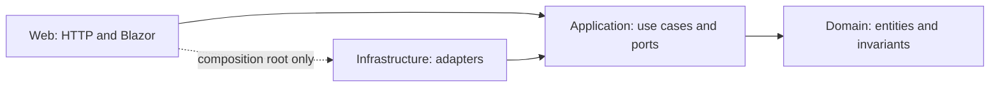

# Architecture

I Have Been is one deployable .NET 10 monolith organized by **Clean Architecture** dependencies and **feature-oriented use cases**. Business rules and workflows live in framework-free projects; HTTP, Blazor, PostgreSQL, Identity and Garage are outer adapters.

## Projects and dependency rules

| Project | Responsibility | Allowed project references |
| --- | --- | --- |
| `IHaveBeen.Domain` | TravelLog aggregate, Experience, MediaAsset, ShareLink and invariants | None |
| `IHaveBeen.Application` | Commands, queries, handlers, results, DTOs and ports | Domain |
| `IHaveBeen.Infrastructure` | EF Core mappings/repositories/migrations, Identity, Garage, temporary files, deletion worker, health checks | Application (Domain available transitively) |
| `IHaveBeen.Web` | Blazor components, HTTP endpoints/contracts, authentication adapters, cookies, middleware and composition root | Application; Infrastructure for registration/migration only |
| `IHaveBeen.UnitTests` | Domain invariants and use cases with in-memory port implementations | Application |
| `IHaveBeen.ArchitectureTests` | Assembly/project/source dependency constraints and entity encapsulation | Web to inspect the whole solution |



`Program.cs` assembles services, optionally runs migrations, configures the request pipeline and maps features. Web features never inject `AppDbContext`, `UserManager`, an AWS client or a concrete Garage adapter.

## Layout

```text
src/
  IHaveBeen.Domain/
    Common/                  domain rule failures
    TravelLogs/              aggregate and validated details
    Experiences/             city sub logs, categories and 0–5 rating rules
    Media/                   original-media entity and supported containers
    Sharing/                 invitation lifecycle
  IHaveBeen.Application/
    Abstractions/            identity, transactions, object storage, cleanup, temp-file ports
    Common/                  Result<T>, errors, Unit
    Accounts/                login/register/logout/profile handlers
    TravelLogs/              create/update/delete commands and list query
    Experiences/             parent/owner-scoped create/update/delete use cases
    Media/                   upload/delete/read/cleanup use cases and signature inspection
    Sharing/                 create/list/revoke/exchange/authorize/shared-query use cases
  IHaveBeen.Infrastructure/
    Identity/                ASP.NET Identity adapter
    Persistence/
      Configurations/        one EF mapping per concern
      Entities/              technical deletion-queue row
      Repositories/          owner-scoped SQL queries and commit adapter
      Migrations/            preserved, versioned PostgreSQL schema
    Security/                cryptographic token adapter
    Storage/                 Garage S3 streams, validated options, disk-backed buffers
    BackgroundJobs/          scheduler invoking the cleanup use case
    Health/                  database/storage availability checks
  IHaveBeen.Web/
    Features/                Accounts, TravelLogs, Experiences, Media, Sharing endpoints/contracts
    Common/                  current-user adapter, error/result translation
    Security/                HTTP headers, antiforgery, share-session cookies
    Configuration/           composition and middleware registration
    Components/
      Pages/                 routing and Dashboard coordination/code-behind
      Journal/               journal list, memory details and editor
      Experiences/           experience editor/list and accessible star control
      Sharing/               share dialog and UI draft
      Map/                   map canvas and shared header presentation
      Layout/                theme, auth/dialog shells and stylesheet loading
    wwwroot/                 browser interop, global CSS tokens and public map assets
```

## Patterns used

- **Dependency inversion:** ports are owned by Application and implemented by Infrastructure/Web. Neither Domain nor Application has package/framework dependencies. No `IQueryable`, `DbSet`, `HttpContext`, `IFormFile`, S3 responses or Identity entities cross into Application.
- **Encapsulated domain:** entities have private setters and factories/behavior methods. Coordinates, date ordering, titles, ownership and invitation lifecycle are validated before state changes. TravelLog owns its media and experience collections; a child cannot be moved into a different memory through public setters.
- **CQRS within one database:** writes use named commands/handlers; reads use query handlers and DTOs. Read queries use EF no-tracking where appropriate. CQRS here means separating operations, not separate databases or event sourcing.
- **Direct handler dispatch:** endpoints inject use-case handlers. A mediator is an optional future dispatch/pipeline mechanism, not a Clean Architecture requirement. Explicit dispatch keeps this project's flow easy to follow.
- **Specific repositories and one commit boundary:** narrow travel/media/share repositories implement the query shapes the app needs. `IUnitOfWork` adapts the scoped EF context's `SaveChangesAsync`; it does not add a second transaction engine. Related row changes and object-deletion enqueueing commit together.
- **Durable object cleanup:** SQL and Garage cannot share an ACID transaction. Uploads first persist delayed cleanup, then store exact bytes, then commit the media and cancel cleanup. Deletions revoke database access immediately and queue object cleanup. A hosted scheduler invokes the same application cleanup use case with a fresh scope.
- **Explicit errors:** `Result<T>` represents expected invalid/not-found/forbidden outcomes. Domain invariants use `DomainRuleException`, translated at use-case boundaries. Web maps errors to Problem Details; an ASP.NET `IExceptionHandler` handles unexpected failures without exposing internals.
- **Typed configuration:** Garage settings use the Options pattern with startup validation; application policies are small immutable values. Database/S3 credentials remain in the outer adapters.
- **Testable time:** domain methods receive `now`; use cases obtain it from injected `TimeProvider`. Expiration tests advance a fake clock rather than sleeping.
- **Cancellation and ownership:** cancellation flows through application I/O. `ICurrentUser` is read from the validated HTTP principal; commands do not accept submitted owner IDs. All persistence lookups constrain ownership or the active invitation's owner and sharing flag.
- **Component composition:** Dashboard coordinates UI state and browser interop; JournalPanel, MemoryDetails, MemoryEditor, ExperienceList, ExperienceEditor, StarRating and ShareDialog render individual concerns. Frontend validation helps users; the domain validates every API write independently.
- **Component stylesheet loading:** companion `.razor.css` files use native Blazor scoping, with application-wide bundling disabled. Each styled component renders its own stylesheet link; conditional child components introduce CSS only when rendered. Shared shells own common presentation. See [component styles](component-styles.md).

## Example request

Creating a memory:

1. Cookie authentication and CSRF checks establish the HTTP caller.
2. `TravelLogEndpoints` maps its HTTP input into `CreateTravelLog` and invokes its handler.
3. The handler reads `ICurrentUser`, creates a validated TravelLog with the injected clock and stages it in `ITravelLogRepository`.
4. EF Core implements that repository and commits through `IUnitOfWork`.
5. The handler returns a protocol-independent DTO; Web adds HTTP resource URLs and a `201 Created` response.

Shared media follows a separate read-only path: Web decrypts the invitation cookie, Application checks the active link/token hash/owner scope/sharing flag, Infrastructure queries metadata and streams the private Garage object. HTTP byte-range parsing and response headers stay in Web. No presigned URL bypasses the application.

## Testing and schema changes

```sh
dotnet restore IHaveBeen.slnx --locked-mode
dotnet build IHaveBeen.slnx -c Release --no-restore
dotnet test --solution IHaveBeen.slnx -c Release --no-build --no-restore
```

Tests use xUnit and Microsoft Testing Platform with .NET 10. Architecture tests check dependency directions, package-free core projects, feature isolation from persistence/Identity/S3 and entity private setters. Unit tests cover experience ownership/ratings/parent relationships, wishlist transitions, unauthorized writes, invariant preservation, durable cleanup, original-byte integrity with short stream reads and deterministic invitation expiration/revocation.

`make check` runs the build plus these tests in Docker. `make smoke` and `make browser` exercise the real PostgreSQL/Garage/.NET stack. CI runs all three levels. Security behaviors remain documented in [security.md](security.md).

Migrations now belong to Infrastructure. The initial migration ID, table names and SQL are preserved; moving CLR namespaces does not reset migration history or require recreating existing data. The separate `ExperiencesAndWishlist` migration adds experience rows and wishlist fields; existing logs default to Visited.

```sh
dotnet tool restore
dotnet ef migrations has-pending-model-changes --project src/IHaveBeen.Infrastructure
dotnet ef migrations add MyChange --project src/IHaveBeen.Infrastructure --output-dir Persistence/Migrations
```

The design-time context factory can generate/check schema metadata without starting HTTP or requiring Garage credentials. `scripts/upgrade-smoke.mjs seed` creates a disposable account/memory/original/invitation on the previous image; `verify` checks the same cookies, resource IDs, originals and invitation after upgrading that isolated stack. Its private fixture is saved only in ignored `output/`.

Apply migrations through the existing one-shot Docker migration service, preserving PostgreSQL/Garage/key volumes.

## Scope decisions

This app benefits from a modular monolith, explicit use cases and testable adapters. Add more components when a requirement calls for them: distributed queues for cross-process work, a mediator for useful cross-cutting pipelines, or domain events for multiple independent reactions to business changes. The current cleanup queue is an object-deletion workflow, not a general event bus. There is no generic repository, reflection-based mapper or external messaging system to learn before changing a memory.

## Primary references

- [Microsoft: Clean Architecture and dependency direction](https://learn.microsoft.com/en-us/dotnet/architecture/modern-web-apps-azure/common-web-application-architectures)
- [Microsoft: architectural principles](https://learn.microsoft.com/en-us/dotnet/architecture/modern-web-apps-azure/architectural-principles)
- [ASP.NET Core: Problem Details and exception handlers](https://learn.microsoft.com/en-us/aspnet/core/fundamentals/error-handling-api?view=aspnetcore-10.0)
- [ASP.NET Core: typed Options and validation](https://learn.microsoft.com/en-us/aspnet/core/fundamentals/configuration/options?view=aspnetcore-10.0)
- [xUnit: .NET 10 and Microsoft Testing Platform](https://xunit.net/docs/getting-started/v3/getting-started)
