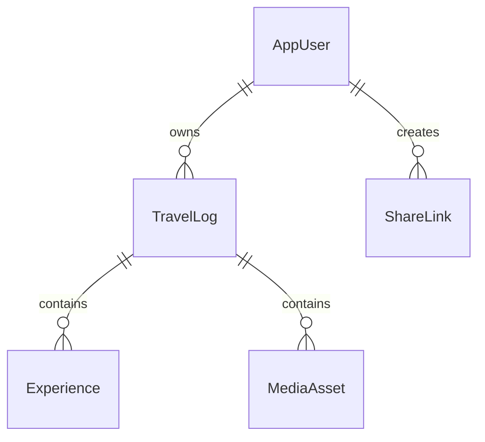

# Database model

PostgreSQL 17 with EF Core/Npgsql migrations. IDs are random UUIDs for application resources; Identity user IDs are opaque strings. All timestamps use UTC `timestamptz`; travel dates use `date`.

| Entity | Main fields | Relationships / rules |
| --- | --- | --- |
| ApplicationUser / Identity tables | ID, display name, email, password hash, security stamp, lockout state, user type | Unique normalized email; user/manager check constraint; database-managed type; framework tables for claims, roles, logins, tokens |
| TravelLog | ID, owner ID, title, description, city, country, latitude/longitude, visited-on, optional ended-on, status (Visited/Wishlist), optional planned-on, include-in-shares, created/updated | User has many logs; owner/date index; valid coordinate bounds and end date; visited entries require a city/date; country-only wishes allow no city/date |
| Experience | ID, log ID, title, description, category, rating (integer 0–5), optional visit date/address, created/updated | City log has many experiences; rating constraint; parent/date index; cascade delete; owner scope through parent |
| MediaAsset | ID, log ID, private object key, original filename, MIME type, byte length, SHA-256, caption, sort order, created | Log has many media; unique object key; no file bytes in PostgreSQL; object key never exposed by APIs |
| ShareLink | ID, owner ID, label, SHA-256 of 256-bit random secret, expiry nullable, revoked-at nullable, created | User has many separately revocable invitations; null expiry means no expiration; plaintext secret returned only once |
| PendingObjectDeletion | ID, object key, created, not-before | Durable cleanup queue independent of deleted log/media rows; retry until Garage deletion succeeds |



The API derives ownership from the authenticated cookie, never from submitted owner IDs. Shared queries require an active invitation plus `TravelLog.IncludeInShares`, scoped to the invitation's owner. Setting a memory private removes it from **all** current invitations immediately. Invitations share the owner's current opted-in journal; they are not immutable snapshots or per-trip grants yet.

Deletion of a log/media row and enqueueing its object keys occur in one database transaction. Uploads pre-register delayed cleanup before storing bytes, then atomically commit the media row and remove the cleanup item. Garage/SQL cannot participate in one ACID transaction; the durable queue closes the common orphan-file gap.

Uploads first validate bounded original bytes in private temporary storage and
require a clean scanner verdict. Only then do they pre-register Garage cleanup
and write an object. Quota races can leave an inaccessible orphan object with
its durable cleanup entry, never an over-quota published media row.

Infrastructure owns EF mappings and migrations; its design-time factory supports tooling without the web host. A single migration service applies checked-in migrations before the app starts. Future production releases should inspect generated SQL, back up first and run one migration job before app rollout. Do not use `EnsureCreated` for schema evolution.

## Journal behavior

- Visited memories and wishlist entries use the same aggregate and authenticated routes. A wish can target a city or an entire country, with an optional planned date. It never invents a visit date.
- `PUT /api/logs/{id}` changes `isWishlist`; marking visited requires a city and visited date, preserves its ID/media/experiences, and clears its planned date. Wishlist updates clear visited dates.
- City experiences use `POST /api/logs/{logId}/experiences`, `PUT`/`DELETE /api/logs/{logId}/experiences/{id}`. Categories: Bar, Restaurant, Party, Museum, Cafe, Attraction, Other. JSON writes use enum values 0–6; responses use category names.
- Experiences inherit ownership and sharing from their parent. They have no separate public route or independent sharing flag. A memory with experiences must keep its city. Originals remain attached to the parent memory.
- Shared journal reads include experiences and wishlist status only for opted-in parents. New entries are private by default.
- Map polygons/pins are green for visited places and yellow for wishlist entries. If a country has both, its polygon remains green and its wishlist city pins remain yellow.
- The initial migration history is retained. `ExperiencesAndWishlist` is applied in place; existing memories default to Visited. PostgreSQL rows, Garage objects, invitation hashes and encryption-key volumes are preserved.

## Account types and upload quotas

- `AccountTypesAndMediaQuota` adds `AspNetUsers.UserType`, required and default
  `user`, constrained to `user`/`manager`. Existing accounts default to `user`;
  no account is automatically promoted or existing media deleted.
- The CLR property has a private setter. Its EF mapping ignores writes both
  before insert and after save: registration uses PostgreSQL's default, while
  login, security-stamp and profile saves cannot reset manual assignments.
- Upload policy reads the type and stored media count from the database on each
  request; it does not trust a type in a form, JSON, cookie or frontend state.
- The `user_media_quota` trigger serializes inserts by locking the owner row,
  then counts media across all their logs. A regular account cannot insert a
  101st row even under concurrent requests or across application replicas.
  Managers bypass the count. Removing media/logs frees slots.
- Journal entries remain uncapped for both types. Media count is the specified
  quota; it does not count travel records or city experiences.
- Quota-trigger failures map to an application conflict (`409`). The database
  remains authoritative for the count if an account type changes during an upload.

An operator runs SQL directly through their database administration connection:

```sql
UPDATE "AspNetUsers"
SET "UserType" = 'manager'
WHERE "NormalizedEmail" = upper('your-email@example.com');

-- To return to the regular limits:
UPDATE "AspNetUsers"
SET "UserType" = 'user'
WHERE "NormalizedEmail" = upper('your-email@example.com');
```

For local Compose, open `psql` with
`docker compose exec postgres psql -U ihb -d ihb`, using your configured
`POSTGRES_USER`/`POSTGRES_DB` if different. Existing originals remain accessible
after a downgrade; uploads are denied until usage is below 100.
