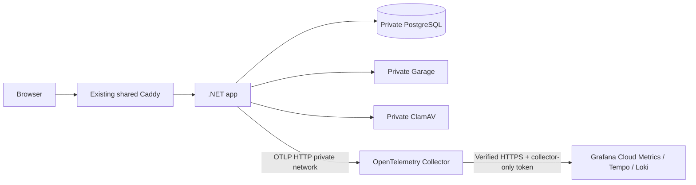

# Monitoring and operational guardrails

The .NET app exports private, bounded OpenTelemetry metrics, traces and operational
warnings. Production uses a private collector to forward them to Grafana Cloud.
`Telemetry.Enabled` defaults to false until configured. No database migration is required.



Only the app joins the shared `proxy` network. The collector publishes no host port,
mounts no Docker socket and joins only the project network plus its own outbound
network. There is no public metrics or telemetry ingestion route.

## What is measured

| Signal | Purpose |
| --- | --- |
| `ihb.http.request.duration` (seconds) | Request rate, p50/p95/p99, status/error rates and route timing, including 401/403/429 responses |
| `ihb.http.active_requests` | Active requests, including long-lived Blazor connections |
| `ihb.database.duration` | EF command latency and success/error/cancellation; query text/parameters are never collected |
| `ihb.dependency.duration` | Garage put/open/delete and ClamAV scan time/outcome |
| `ihb.uploads` | Accepted uploads and quota, size, format, malware or unavailable-scanner rejections |
| `ihb.dependency.healthy`, `ihb.healthcheck.duration` | PostgreSQL/Garage and enabled ClamAV probes every 60 seconds, with a 10-second probe budget |
| `System.Runtime` | Process memory/CPU, GC, exceptions and thread-pool pressure |
| Sampled traces | Request spans with child database, storage and scan spans |
| Safe operational warnings | Server errors, throttling and dependency health changes; trace IDs correlate sampled requests |

Durations measure server work. Garage open and DB execution end when response
headers/readers arrive; HTTP duration includes streaming media to the browser.
Blazor connections and readiness probes are separate latency populations. The
shipped API panels select `/api/*` routes. The latency alert excludes media and
offline snapshot transfers. Offline browser activity is not sent to the server.

## Privacy and cost controls

- Route **templates**, fixed methods/statuses, operation names and outcomes are the
  only request/dependency dimensions. Unknown paths map to `unmatched`, unknown
  methods to `OTHER`.
- No user/email IDs, route values, raw URLs/query strings, cookies, headers, passwords,
  share tokens, object keys, captions, log bodies, media bytes or SQL/parameters.
- Request traces start with a fresh trace context: inbound baggage, tracestate and
  caller-controlled sampling decisions are not trusted.
- Only the dedicated `IHaveBeen.Operations` warning logger is exported. Framework/EF
  logs and scopes are excluded. Cloud request warnings are capped at 30/minute per
  process; metrics still count all completions. Console logs remain local.
- Collector attribute allowlists provide a second boundary. Add new telemetry only
  through fixed dimensions, and extend the privacy export test before exporting it.
- 10% trace sampling by default; all aggregated measurements are counted, subject
  to bounded cardinality. Histograms cap at 512 HTTP / 128 dependency / 16 database
  series; other instruments cap at 64. SDK overflow aggregation preserves totals.
- Metrics export every 60 seconds. App export timeout: 3 seconds; trace queue: 512
  spans / 128 batch; log queue: 256 records / 64 batch.
- Collector: 256 MiB container cap, 160 MiB limiter with 32 MiB spike budget, 0.5 CPU,
  read-only root, dropped capabilities, no privilege escalation, 128 queued batches,
  two export workers and retries bounded to 60 seconds. Logs rotate at 10 MiB × 3.
- Telemetry is asynchronous and best effort: outages/drop limits can lose telemetry,
  and never become application readiness dependencies. It is not an audit ledger.

Existing IP/account/concurrency limits, media quotas, upload deadlines, private
storage and fail-closed ClamAV remain enforced. OpenTelemetry measures those controls;
it does not replace them.

## Local verification

From the repository:

```sh
make observability
make observability-logs
```

This uses a private local collector with a debug exporter and an internal-only
Prometheus preview on port 8889. It does not send data to Grafana. Inspect collector
logs for route timing and runtime metrics after making requests. No port is exposed
on the host. `make observability` enables instrumentation for that Compose command;
to preserve it across `make refresh`, set `TELEMETRY_ENABLED=true` and
`COMPOSE_PROFILES=observability` in the existing private `.env`.

To return to normal local defaults, set both settings off/empty, run
`docker compose up -d --no-build app`, then
`docker compose --profile observability stop otel-collector`.

The collector outage test is restricted to disposable stack names:
`node scripts/telemetry-smoke.mjs ihb-otel-check`. CI runs it against `ihb-ci`.
It checks real OTLP export, privacy canaries, metric names, collector isolation and
continued readiness/API responses with the collector stopped.

## Activate production Grafana Cloud

1. In your Grafana Cloud stack, open **OpenTelemetry → Configure**. Obtain the OTLP
   `/otlp` HTTPS endpoint, numeric instance ID and a write-only access-policy token
   scoped to the stack's metrics/logs/traces ingestion. Keep the token in private
   configuration; never paste it into chat or commit it.

   ```dotenv
   TELEMETRY_ENABLED=true
   COMPOSE_PROFILES=observability
   TELEMETRY_TRACE_SAMPLE_RATIO=0.1
   TELEMETRY_METRIC_INTERVAL_MS=60000
   GRAFANA_CLOUD_OTLP_ENDPOINT=https://your-otlp-gateway.grafana.net/otlp
   GRAFANA_CLOUD_INSTANCE_ID=123456
   GRAFANA_CLOUD_API_TOKEN=your-private-write-token
   ```

2. Push/merge to `main` using the existing release workflow. Deployment validates
   profile/credentials and verified HTTPS before changing services, starts the
   collector with the app's infrastructure, and tags telemetry with the release SHA.
   The token exists only in the collector environment, not the app/migrator/image.
3. Import `infra/grafana/dashboard.json` through **Dashboards → New → Import** and
   select your Cloud Metrics datasource. Choose `production` in the dashboard.
4. In Explore: Prometheus `ihb_http_request_duration_seconds_count{job="i-have-been"}`;
   Tempo `{ resource.service.name = "i-have-been" }`; Loki `{service_name="i-have-been"}`.
   Wait a metric interval after making requests. Grafana's normal OTLP-to-Prometheus
   translation is used: underscores and unit/type suffixes.
5. Load `infra/grafana/alerts.yaml` as datasource-managed Prometheus/Mimir rules
   using Grafana's rule tooling, or create equivalent Grafana-managed rules from the
   expressions. Configure a contact point and notification routing in Grafana; no
   notifications are sent or activated by this repository.
6. Add an independent HTTPS uptime check for `https://<APP_HOSTNAME>/health/ready`
   (expected 200 and `{"status":"ready"}`). An absent-telemetry alert covers
   exporter/collector outages; an independent check can also see full app outages.

Metrics for uploads/storage operations appear after those operations occur.

The dashboard covers p50/p95/p99, request/error/throttling rates, slow routes,
DB/storage/scanning latency, dependency health, upload outcomes and memory/CPU/GC.
Alert thresholds are initial operational defaults: p95 >2s for 10m; 5xx >5% with at
least 20 requests/5m; dependency unavailable 3m; 429 >1/s for 5m; no health telemetry
10m; process memory >80% of the default 768 MiB app cap. Adapt to measured usage.

For datasource-managed rule loading, use the **Cloud Metrics/Mimir** endpoint and
rule-write credentials from Grafana; the OTLP ingestion token/endpoint is a different
purpose. Follow the official [Mimirtool guide](https://grafana.com/docs/mimir/latest/manage/tools/mimirtool/).

Cloud export, dashboard import, alert routing and the independent uptime check
require your Grafana account settings; they are not activated automatically.

## Operations

- Missing data: inspect collector state/logs, endpoint/token validity, then app
  readiness. Credentials stay in mode-0600 runtime configuration. Do not print the
  resolved Compose environment to shared logs.
- 5xx/slow API: inspect route metrics, correlate a sampled trace, then compare query,
  storage and scanning duration. Trace sampling can omit an individual request.
- Dependency alert: check the matching container and its persistent volume. Stale
  ClamAV definitions reject uploads intentionally; do not disable scanning to clear it.
- Memory pressure: inspect process/GC metrics and Docker container usage. Working set
  is not total container memory. Update the alert threshold if app memory cap changes.
- Disable export: set `TELEMETRY_ENABLED=false`, clear `COMPOSE_PROFILES` in
  the droplet `.env`, then deploy normally. The previous collector can remain idle;
  stop it with the current-release Compose helper's `--profile observability stop
  otel-collector` command. Preserve all application data volumes.
- Keep traces/metrics/log retention and token rotation appropriate to your Grafana
  plan. Redaction and bounded queues reduce data volume; they do not guarantee a bill.

## Primary references

- [OpenTelemetry .NET](https://opentelemetry.io/docs/languages/dotnet/)
- [OpenTelemetry metric views and cardinality](https://github.com/open-telemetry/opentelemetry-dotnet/blob/main/docs/metrics/customizing-the-sdk/README.md)
- [Grafana Cloud collector setup](https://grafana.com/docs/opentelemetry/collector/opentelemetry-collector/)
- [.NET runtime metrics](https://learn.microsoft.com/en-us/dotnet/core/diagnostics/built-in-metrics-runtime)
- [Prometheus OTLP conversion](https://prometheus.io/docs/guides/opentelemetry/)

When malware scanning is explicitly disabled, the app omits the scanner health
probe and its dependency measurements; it does not report skipped files as
successful antivirus scans. PostgreSQL/Garage and request/upload metrics remain.
